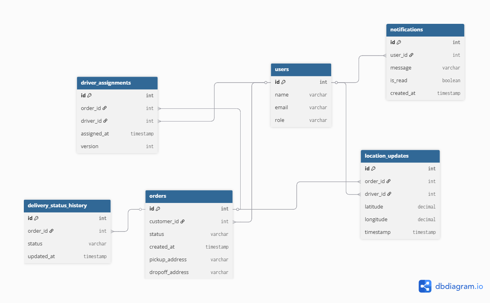

# 🚚 Real-Time Delivery Tracking System

A robust backend service designed to manage and monitor orders efficiently from creation to doorstep. This system enables seamless coordination between customers and drivers with live location updates and status monitoring.

## 🌟 Project Overview
This project provides a centralized backend where:
* **Drivers** can update their live location and delivery status.
* **Orders** are dynamically assigned to available drivers.
* **Users** can track their delivery progress in real-time.

## 🗺️ Project Planning & Architecture
To maintain a professional engineering workflow, the following resources are used for planning:

* **Project Management:** [View Trello Board](https://trello.com/b/Ao1MNZnD/backend-api-spring-boot-application) 📋
* * **Database Design (ERD):**  

